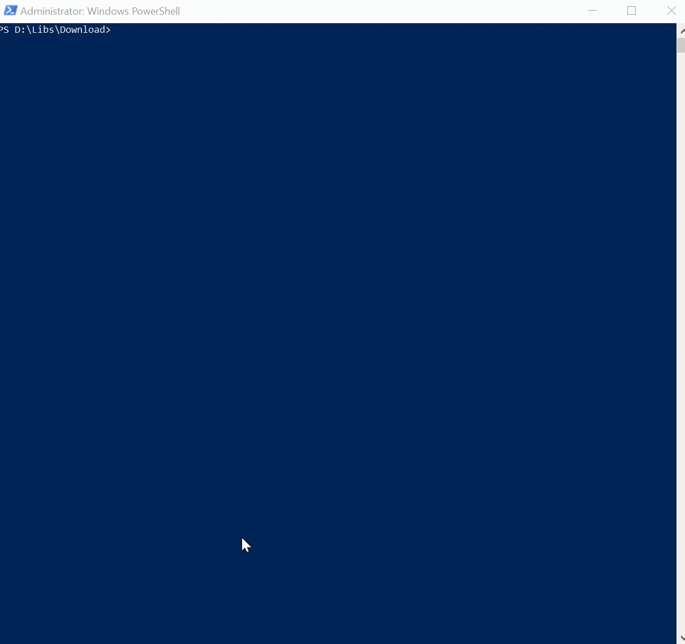

# Get Random Generator Password

The idea behind this script is to get several password using the class System.Web.Security.Membership and the method Generate Password to generate as several passwords and then take a portion of each for the final password.

## Parameters

The parameters of this script are:
- **Long:** 2 parameter string that accepts 1 or 2 digits, Script will create this number of random passwords.
- **Int:** 2-digit parameter to take from each random password.

For example long =12 and int =3  => 12/3 = 4 different password from where 3 digits from each will be on the final password of 12 digits.

> [!NOTE]
> The final Password will contain (Long/Int) => This division must be always be an int number


## How to Use the script

As usual, will be explained as examples:

### Example Default parameter Long

```Powershell
    .\Get-RandomPwd.ps1 -Long 30
```

### Output

**ORIGINAL Passwords** </br>
```
-O]i:LHYPa ##Eh1/wz*w EZyLEf&aql
rGo61m!b?5 .3ly;vs/^S OIqQHhK9CS
%FD4>TTw5W J693!oe/am ^k5mJa#tp|
```

**Final Passwords** </br>

**-O]i:LHYPa** *.3ly;vs/^S* ^k5mJa#tp|



Full screen image can be seen [here](https://recordit.co/6NwMlDhNym)


## Related articles

Original Technet Script on [Password Generator using Powershell 5](https://gallery.technet.microsoft.com/Password-Generator-using-0f99f008). **2k downloads**
