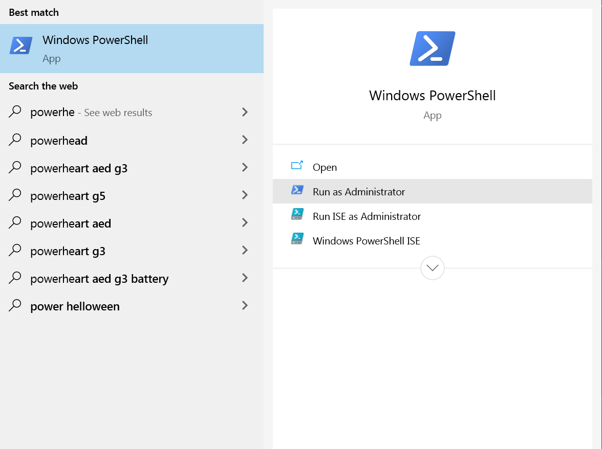
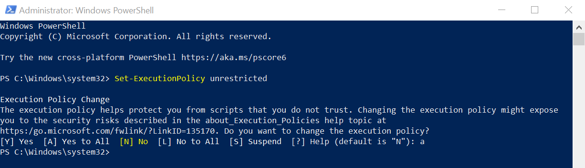
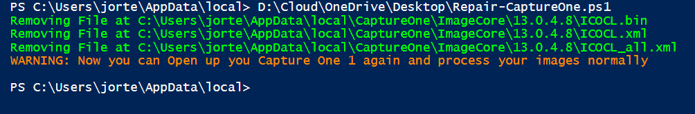

# Repair-CaptureOne (Windows)

Sometimes when you're working with your capture one software, when you process an image with the recipes, it gets stuck and nothing happens.

The oficial document [Troubleshooting OpenCL in case of Viewing/processing/Exporting Problems](https://support.captureone.com/hc/en-us/articles/360002404937-Troubleshooting-OpenCL-in-case-of-viewing-processing-exporting-problems)


> [!IMPORTANT]
> This script is based on the official document and solves the issue based on the solution shown on the link
 

## Prerequisites to use the script

You would need the following:

- Open Powershell as Administrator

- Run on Powershell
```Powershell
Set-ExecutionPolicy unrestricted
```

- And Accept the change.

- Download the script at [clicking]
- Move the file into the Desktop
- <b>Make sure you have closed Capture One software</b>

>[!IMPORTANT]
> You can leave it open, the script will manage to close it. The only thing is that when you open the software again it will detect that it was not closed clearly.

- Run on Powershell
```Powershell
.\Repair-CaptureOne.ps1
```



Thank you very much for downloading and please do not forget to rate, or propose if you have another idea.


## Powershell is my hobby

#Other interesting Links


- If you have questions or want me to do something live, here's [my Afiliate Twitch Channel (Spanish/English)](https://twitch.tv/j0rt)
- If you want to thank in any way you can [donate here](https://streamlabs.com/j0rt/tip) whatever you want. 

# Other Interesting Script Links


