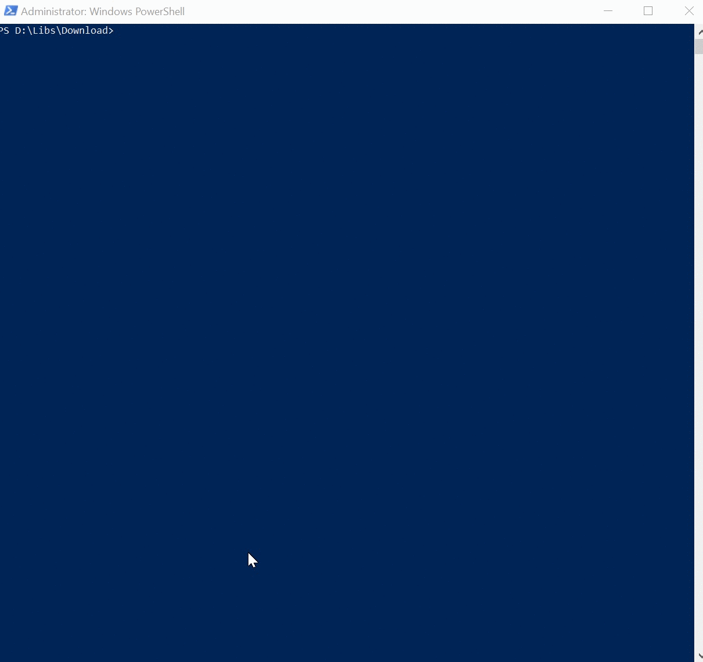

# Do-OAUth20ForUnsplash

It would do the OAuth 2.0 handshake process to get your Bearer token.
On unsplash API the token never expires so, once you do it once, you wouldn't need to do it again, ever.


> [!IMPORTANT]
> Unsplash API beared token?. What's that? </br>
> After an OAuth 2.0 process, you'd get a sequence of chars which allow your queries to the Unsplash API to authenticate your queries. These tokens don't expire,  allowing you can use that in your application, the whole idea is to simplify the process of getting a token and use it.
 

## Prerequisites to use the script

You would need the following:

- [Create an account on Unsplash](###Create-an-account-on-unsplash)
- Create a [new aplication](###How-to-create-a-new-application-on-the-developers-site) on the [developer's site](https://unsplash.com/developers)

### Create an account on unsplash

It's quite easy, navigate to [https://unsplash.com](https://unsplash.com), and then click join


Then just fill out or login with facebook


### How to create a new application on the developers site

Once you have followed the instructions to [Create an account](###Create-an-account-on-unsplash).

Click here for details on [how to create a new application and prepare it for the script](Create-application)

## Parameters

The parameters of this script are:
- **Long:** 2 parameter string that accepts 1 or 2 digits, Script will create this number of random passwords.
- **Int:** 2-digit parameter to take from each random password.

For example long =12 and int =3  => 12/3 = 4 different password from where 3 digits from each will be on the final password of 12 digits.

> [!NOTE]
> The final Password will contain (Long/Int) => This division must be always be an int number


## How to Use the script

As usual, will be explained as examples:

### Example Default parameter Long

```Powershell
    .\Get-RandomPwd.ps1 -Long 30
```

### Output

**ORIGINAL Passwords** </br>
```
-O]i:LHYPa ##Eh1/wz*w EZyLEf&aql
rGo61m!b?5 .3ly;vs/^S OIqQHhK9CS
%FD4>TTw5W J693!oe/am ^k5mJa#tp|
```

**Final Passwords** </br>

**-O]i:LHYPa** *.3ly;vs/^S* ^k5mJa#tp|



Full screen image can be seen [here](https://recordit.co/6NwMlDhNym)


## Related articles

Original Technet Script on [Password Generator using Powershell 5](https://gallery.technet.microsoft.com/Password-Generator-using-0f99f008). **2k downloads**


 # Get Random Generator Password

The idea behind this script is to get several password using the class System.Web.Security.Membership and the method Generate Password to generate as several passwords and then take a portion of each for the final password.

## Parameters

The parameters of this script are:
- **Long:** 2 parameter string that accepts 1 or 2 digits, Script will create this number of random passwords.
- **Int:** 2-digit parameter to take from each random password.

For example long =12 and int =3  => 12/3 = 4 different password from where 3 digits from each will be on the final password of 12 digits.

> [!NOTE]
> The final Password will contain (Long/Int) => This division must be always be an int number


## How to Use the script

As usual, will be explained as examples:

### Example Default parameter Long

```Powershell
    .\Get-RandomPwd.ps1 -Long 30
```

### Output

**ORIGINAL Passwords** </br>
```
-O]i:LHYPa ##Eh1/wz*w EZyLEf&aql
rGo61m!b?5 .3ly;vs/^S OIqQHhK9CS
%FD4>TTw5W J693!oe/am ^k5mJa#tp|
```

**Final Passwords** </br>

**-O]i:LHYPa** *.3ly;vs/^S* ^k5mJa#tp|


Full screen image can be seen [here](https://recordit.co/6NwMlDhNym)


## Related articles

Original Technet Script on [Password Generator using Powershell 5](https://gallery.technet.microsoft.com/Password-Generator-using-0f99f008). **2k downloads**


# Unsplash API bore token?. What's that?
Basically, after an OAuth 2.0 process, you'd get a sequence of chars which allow your queries to the Unsplash API to authenticate your queries. These tokens don't expire,  allowing you can use that in your application, the whole idea is to simplify the process of getting a token and use it.

# Sounds great, how do I use it?
The first step is to change the ExecutionPolicy to Unrestricted, so:

 

 

```PowerShell
Set-ExecutionPolicy Unrestricted
 ```
 


Moreover, then you have 2 options:

* *Use the 2 parameters (ClientID and client Clientsecret), that you obtain directly from the Web API after registering an App (https://unsplash.com/documentation). Like this:**

 

 

```PowerShell
.\Do-Oath20forUnsplash.ps1 -Clientid "<yourclientId>" -ClientSecret "<yourclientsecret>"
 ```
 

*Open the script, and change lines 2 and 3 to add your ClientId and your ClientSecret and then run the script without parameters.*

 
 

```PowerShell
.\Do-Oath20forUnsplash.ps1
```

# What's the output of the script


 

# Ok, I've got the Token, now, how do I use it?
As explained on the [Unsplash API reference](https://unsplash.com/documentation#authorization-workflow) On subpoint 4, you can use the authorization  property with the value "bearer <access code>"

 

Authorization: Bearer ACCESS_TOKEN
Also, execute any query on the pictures that you have on the scope.

 

Thank you very much for downloading and please do not forget to rate, or propose if you have another idea.

# Powershell is my hobby